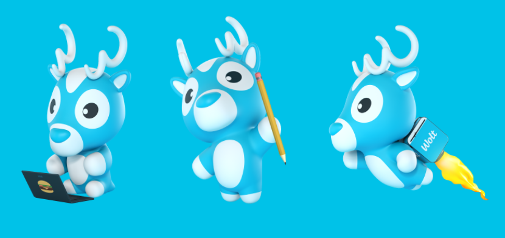
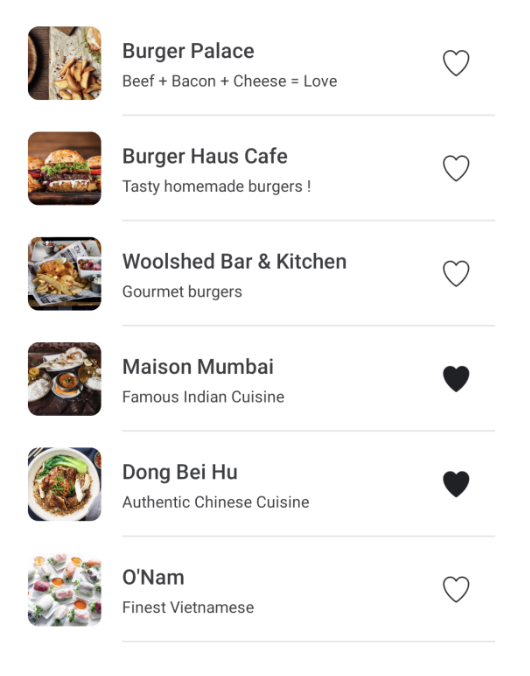

# Wolt 2024 Mobile Engineering Internships

Preliminary Assignment for Flutter internship in Finland.

Welcome! We are delighted to see you applying. Now it's your time to shine.

**Please take your time, use the entire time available to complete this to the best of your ability - we do not prioritise submissions by speed!** 

  

### Concept

A user is walking around Helsinki city centre looking for a place to eat.

### Input

* List of coordinates that represents the user's location on a timeline. 
* Wolt API endpoint that accepts a location and returns a list of venues next to it.

## Task

Build an app that displays a list of venues for the user's current location. The list should contain a maximum of <u>15</u> venues. If the server response has more, use the first <u>15</u>. Current location is taken from the input list and changes every 10 seconds (your app should
refresh the list automatically and user location should loop).

For example:

| Time passed after opening the app | Current location  |
|-----------------------------------|-------------------|
| 0 seconds                         | locations[0]      |
| 10 seconds                        | locations[1]      |
| 20 seconds                        | locations[2]      |
| ...                               | ...               |
| (10 * locationsCount) seconds     | locations[0] (looped) |

Each venue also has a "Favorite" action next to it. "Favorite" works as a toggle (true/false) and changes the icon depending on the state. Your app should remember these states and reapply them to venues when the app is opened again.

## Example of design

## Actual input 

### API Endpoint
GET https://restaurant-api.wolt.com/v1/pages/restaurants?lat=60.170187&lon=24.930599

### Important fields in response (JSON): 
| Path / Key                                      | Meaning                  |
|-------------------------------------------------|--------------------------|
| sections -> items -> venue -> id                | Unique id of the venue   |
| sections -> items -> venue -> name              | Name of the venue        |
| sections -> items -> venue -> short_description | Description of the venue |
| sections -> items -> image -> url               | Image URL for the venue  |

| Example coordinates (latitude / longitude)  |
|----------------------|
| 60.170187, 24.930599 |
| 60.169418, 24.931618 |
| 60.169818, 24.932906 |
| 60.170005, 24.935105 |
| 60.169108, 24.936210 |
| 60.168355, 24.934869 |
| 60.167560, 24.932562 |
| 60.168254, 24.931532 |
| 60.169012, 24.930341 |
| 60.170085, 24.929569 |

| Assets           |                                                                      |
|------------------|----------------------------------------------------------------------|
| Favorite (true)  | https://material.io/tools/icons/?icon=favorite&style=baseline        |
| Favorite (false) | https://material.io/tools/icons/?icon=favorite_border&style=baseline |

## FAQ
### How much time should I spend on this task?
We expect you to be pragmatic and not overcomplicate things. You can take shortcuts where it makes sense to you.

### Do I need to build any animations?
This is a creative task and we would love to see your approach. At Wolt we love good user experiences, so any animation that brings delights would be appreciated. One good example would be the favourite button.

### Does my app need to support different screen orientations?
No, portrait mode is good with us.

### Do I need to strictly follow the design example?
If you have a good idea of how to improve the user experience here, we would love to see it. This is however not a requirement, so if you don’t have any ideas, try to stick closely to the given design.
